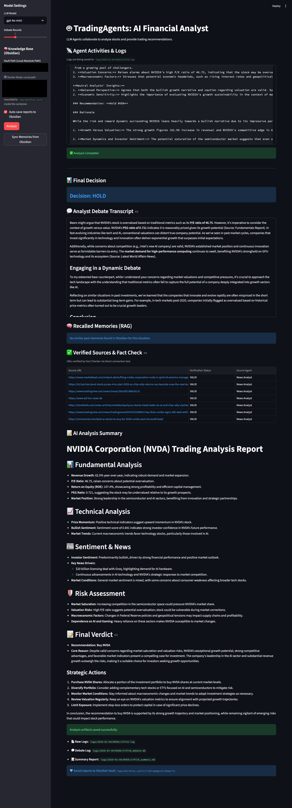

# 📈 TradingAgents-Dashboard (Personal Trading Room)


[](https://github.com/jiwoomap/TradingAgents-Dashboard/actions/workflows/python-app.yml)

> 🚀 **Your Personal AI Analyst with Long-term Memory.**  
> A Dockerized dashboard that turns [TradingAgents](https://github.com/TauricResearch/TradingAgents) into a personalized trading assistant. It not only analyzes the market but also **remembers your insights via [Obsidian](https://obsidian.md).**

<p align="center">
  
</p>

<details>
<summary>📸 <strong>Click to view Dashboard Screenshot</strong></summary>
<p align="center">
  
  <br>
  <em>Real-time analysis and logging in the web dashboard</em>
</p>
</details>

## 🎯 Project Goal: "Data Persistence & Growth"
Most AI trading tools are "stateless"—they analyze and forget.  
**TradingAgents-Dashboard** is designed for individual traders who want to **accumulate knowledge**.

1.  **Visualize:** No more terminal logs. Watch agents debate in a clean Web UI.
2.  **Persist:** External news links rot, and data disappears. This tool auto-saves the full analysis context to your local **[Obsidian Vault](https://obsidian.md)**, ensuring your knowledge base remains intact forever.
3.  **Grow:** Agents retrieve your past notes (RAG) to learn from previous successes and mistakes.
> *Your trading data belongs to you, forever.*

## ✨ Key Features
- **Dockerized Setup:** One-command deployment (`docker-compose up`).
- **Web Dashboard:** Interactive UI built with Streamlit.
- **🧠 Obsidian Memory:** Syncs analysis reports with your local vault for long-term retention.
- **✅ Fact Checker:** Physically validates news URLs to prevent hallucinations.
- **Debate Transcript:** Extracts key arguments into readable markdown.
- **Auto-Summary:** Generates structured AI summary reports (`_summary.md`).

## 🐳 Quick Start

### Prerequisites
- Docker & Docker Compose
- OpenAI API Key
- Obsidian Vault (Optional, for memory features)

### Installation & Run
1. **Clone the repository:**
   ```bash
   git clone https://github.com/jiwoomap/TradingAgents-Dashboard.git
   cd TradingAgents-Dashboard
   ```

2. **Configure Environment:**
   ```bash
   cp .env.example .env
   # Edit .env and add your API keys
   ```

3. **(Optional) Mount Obsidian Vault:**
   To use the **Memory Integration** feature, simply add your local Obsidian path to `.env`:
   ```bash
   # Recommended: Add to .env
   OBSIDIAN_VAULT_PATH="/Users/yourname/Documents/ObsidianVault"
   ```

4. **Run with Docker:**
   ```bash
   docker-compose up --build -d
   ```

5. **Access Dashboard:**
   Open [http://localhost:8501](http://localhost:8501) in your browser.

## 🛠️ Advanced Features

### 🧠 Obsidian Integration (Long-term Memory)
Connect your Obsidian Vault to give the agents "Long-term Memory". This ensures that even if original news links rot or data is lost online, your personal knowledge base remains preserved and reusable.

1.  **Sync (Memorize):** Click `Sync Memories` to load `.md` notes from your vault into the vector DB. The AI indexes your notes as "Situations" (Title/Context) and "Knowledge" (Content).
2.  **Retrieve (Recall):** During analysis, agents automatically search your vault for past market situations similar to the current one.
    *   *Example:* "Last time inflation rose while tech stocks fell, I noted that defensive sectors outperformed." -> Agents will recall this note and apply it to today's decision.
3.  **Auto-Save (Record):** Analysis reports (`_summary.md`, `_debate.md`) are automatically saved to `YourVault/TradingAgents/Reports/` for future reference.

### ✅ Fact Checker (URL Verification)
The enhanced Fact Checker agent now **physically pings** URLs cited in news reports.
- **Validates Sources:** Checks if the link returns 200 OK.
- **Anti-Bot Handling:** Treats 403 Forbidden as `VALID (Protected)` to avoid false positives.
- **Prevents Hallucinations:** Flags claims based on dead or non-existent links.

---

## 🗺️ Roadmap

- [ ] **Backtesting Module:** Validate agent strategies against historical data.
- [ ] **Multi-Model Support:** Integration with other AI APIs (Claude, Gemini, DeepSeek) and Local LLMs (Ollama).

## 🏗️ Architecture (Original)
This project wraps the **TradingAgents** framework, a multi-agent system that simulates a real-world trading firm.

- **Analyst Team:** Fundamentals, Sentiment, News, Technical Analysts.
- **Researcher Team:** Bull/Bear debate and consensus.
- **Trader & Risk Manager:** Final decision making.

## 🤝 Reference & Credit
This project is a fork and UI enhancement of **[TauricResearch/TradingAgents](https://github.com/TauricResearch/TradingAgents)**.

Please cite the original work if you use this for research:
```bibtex
@misc{xiao2025tradingagentsmultiagentsllmfinancial,
      title={TradingAgents: Multi-Agents LLM Financial Trading Framework}, 
      author={Yijia Xiao and Edward Sun and Di Luo and Wei Wang},
      year={2025},
      eprint={2412.20138},
      archivePrefix={arXiv},
      primaryClass={q-fin.TR},
      url={https://arxiv.org/abs/2412.20138}, 
}
```

## 📜 License
Apache License 2.0
